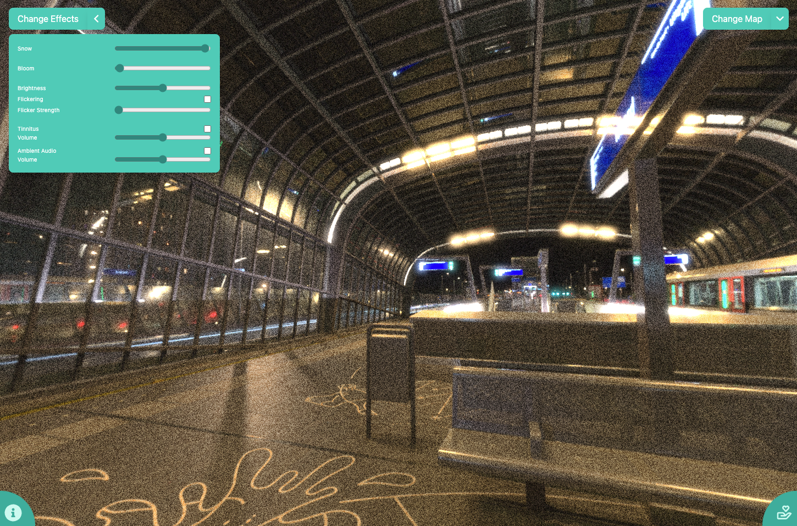

# Visual Snow Simulator

<!-- Image -->


## Introduction
Welcome to Visual Snow Simulator, an open-source project dedicated to raising awareness of Visual Snow. This repository is the main hub for development, where contributors like you can help us grow and improve the project.

## Getting Started
To get started with contributing to the Visual Snow Simulator, please follow these steps:

### Prerequisites
- Ensure you have Node.js installed.
- A recommended IDE or editor (e.g., VSCode, PyCharm).

### Setting Up Your Development Environment
1. **Clone the repository:**
   ```bash
   git clone https://github.com/finnianj/visualSnowSimulator
   cd visualSnowSimulator
   ```

2. **Install dependencies:**
   ```bash
   npm install   
   ```

3. **Run the application locally:**
   ```bash
   npm run dev
   ```

## Contributing
We love your input! We want to make contributing to this project as easy and transparent as possible, whether it's:
- Reporting a bug
- Discussing the current state of the code
- Submitting a fix
- Proposing new features
- Becoming a maintainer


## Deployment
Changes in this repository are reviewed before being mirrored to a private repository, which handles all deployment-related configurations and processes. For deployment requests or issues, please [open an issue](https://github.com/yourusername/project-name/issues).

## Support and Contact
If you have any questions or need support, please [open an issue](https://https://github.com/finnianj/visualSnowSimulator/issues/new) for help.

## License
Visual Snow Simulator is licensed under the [MIT License](LICENSE.md).
```
