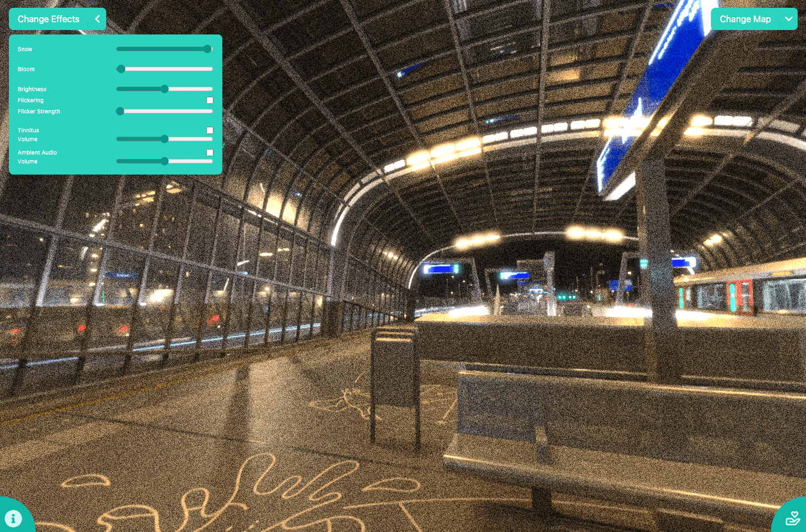

# Visual Snow Simulator

<!-- Image -->


## Introduction
Welcome to Visual Snow Simulator, an open-source project dedicated to raising awareness of [Visual Snow](https://www.visualsnowinitiative.org/). 

## Contributing
We love your input! We want to make contributing to this project as easy and transparent as possible, whether it's:
- Reporting a bug
- Discussing the current state of the code
- Submitting a fix
- Proposing new features
- Becoming a maintainer

## Deployment
Changes in this repository are reviewed before being mirrored to a private repository, which handles all deployment-related configurations and processes. For deployment requests or issues, please [open an issue](https://github.com/yourusername/project-name/issues).

## Support and Contact
If you have any questions or need support, please open an issue for help.

## License
Visual Snow Simulator is licensed under the [MIT License](LICENSE.md).

Learn more about visual snow on the [Visual Snow Initiative website](https://www.visualsnowinitiative.org/).
```
